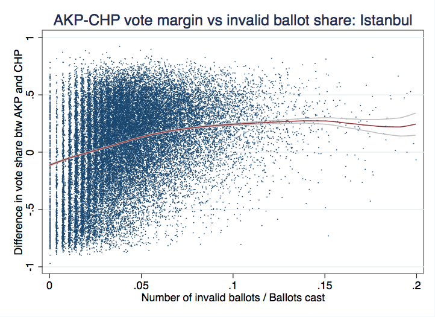
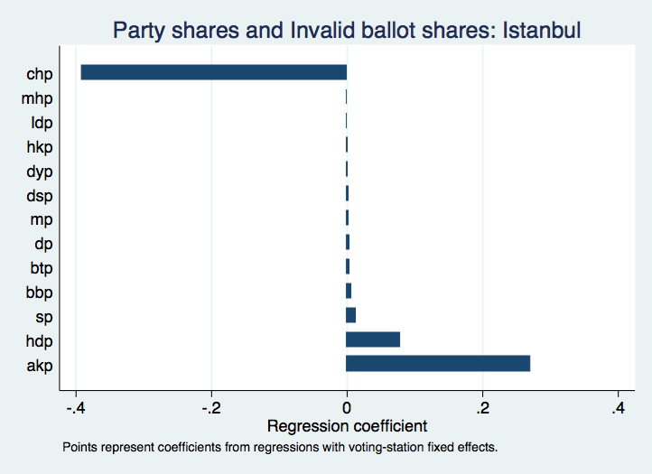

## Outline

- About Data Science 
- Introduction & Previous Work
- New Work
- Discussion & Conclusion
- Future Possible Directions
- References

## About Data Science 

- Statistical analysis of vast amount of heterogeneous data

- Visualization of the data distribution and implications

- Interdisciplinary applications

- Powerful tool in both academia and employment

## Introduction 

- 2014 Turkish mayoral election
- AKP vote share vs. Turnout rates

```{r echo=FALSE, message=FALSE, warning=FALSE}
#Read and summarize the data 
ankara <- read.csv("ankara.csv")

#Select and reshape the dataset
library(dplyr)
df <- select(ankara, 9, 12, 15, 21, 29, 31)

library(reshape2)
df_l <- melt(df, id=c("itirazsiz_gecerli_oy", "gecersiz_oy"))

df_n <- group_by(df_l, variable) %>% 
  summarize(s = sum(value))

library(ggplot2)

#Get the sum of votes from all the parties
total_vote <- select(ankara, 16:32)
ankara$total_vote <- rowSums(total_vote, na.rm=T)

#Calculate akp total vote share
ankara$akp_total_vote_share <- (ankara$akp_oy/ankara$total_vote)

#Add akp and chp number of votes
ankara$akp_plus_chp=(ankara$akp_oy+ankara$chp_oy)

#Substract chp from akp votes
ankara$akp_minus_chp=(ankara$akp_oy-ankara$chp_oy)

#Divide valid votes and registered votes gives the turnout rate
ankara <- mutate(ankara, turn_out_rates = gecerli_oy/kayitli_secmen)
ankara <- mutate(ankara, turn_out_rates2 = kullanilan_toplam_oy/kayitli_secmen)

#Divide invalid votes and actual votes gives the invalid ballot share
ankara$ballot=(ankara$gecersiz_oy/ankara$kullanilan_toplam_oy)

#Make the scatter plot of akp total vote share and turnout rates
pl1 <- ggplot(ankara, aes(x=turn_out_rates, y=akp_total_vote_share),
              ggtitle="AKP Total Vote Share vs turnout")

pl1 <- pl1 + geom_point(size=2, colour="blue") +xlim(0.2, 1.2) +ylim(0, 1) +
  xlab("Turnout") +
  ylab("AKP Total Vote Share")

pl1
```

## Previous Work

- Twitter: Erik Meyersson
- Further analysis of the invalid ballot
 

## Previous Work

- Regression coefficient
 
 
## Previous Work

```{r, echo=FALSE}
pl <- ggplot(df_n, aes(x=variable, y=s)) + 
  geom_bar(stat="sum") +
  xlab("party name") +
  ylab("votes") +
  ggtitle("Turkish election vote summary") +
  scale_x_discrete(breaks=c("oy_kullanan_kayitli_secmen", "akp_oy", "chp_oy", "mhp_oy"),
                   labels=c("Total Votes", "Justice and Development Party", "Republican People's Party", "Nationalist Movement Party"))
pl <- pl + theme(axis.text.x = element_text(angle=30, hjust=1, vjust=1)) + theme(legend.position="none")

print(pl)
```

## Previous Work

```{r echo=FALSE, message=FALSE, warning=FALSE}
#Read and summarize the data 
ankara <- read.csv("ankara.csv")

#Select and reshape the dataset
library(dplyr)
df <- select(ankara, 9, 12, 15, 21, 29, 31)

library(reshape2)
df_l <- melt(df, id=c("itirazsiz_gecerli_oy", "gecersiz_oy"))

df_n <- group_by(df_l, variable) %>% 
  summarize(s = sum(value))

library(ggplot2)

#Get the sum of votes from all the parties
total_vote <- select(ankara, 16:32)
ankara$total_vote <- rowSums(total_vote, na.rm=T)

#Calculate akp total vote share
ankara$akp_total_vote_share <- (ankara$akp_oy/ankara$total_vote)

#Add akp and chp number of votes
ankara$akp_plus_chp=(ankara$akp_oy+ankara$chp_oy)

#Substract chp from akp votes
ankara$akp_minus_chp=(ankara$akp_oy-ankara$chp_oy)

#Divide valid votes and registered votes gives the turnout rate
ankara <- mutate(ankara, turn_out_rates = gecerli_oy/kayitli_secmen)
ankara <- mutate(ankara, turn_out_rates2 = kullanilan_toplam_oy/kayitli_secmen)

#Divide invalid votes and actual votes gives the invalid ballot share
ankara$ballot=(ankara$gecersiz_oy/ankara$kullanilan_toplam_oy)

#Make the scatter plot of akp total vote share and turnout rates
pl1 <- ggplot(ankara, aes(x=turn_out_rates, y=akp_total_vote_share),
              ggtitle="AKP Total Vote Share vs turnout")

pl1 <- pl1 + geom_point(size=2, colour="blue") +xlim(0.2, 1.2) +ylim(0, 1) +
  xlab("Turnout") +
  ylab("AKP Total Vote Share")

pl1
```

## New Work

- Comparison of two groups of data
  
  - Linear Regression

  - Slopes 
  
    - Ideal: Normal distribution of residuals
  
      - Two-sample z-test
      
      - p-value
  
    - Real: Non-normal distribution of residuals
      
      - Bootstrapping
  
      - Confidence Interval
  
      - Non-parametric t-test
  
## New Work: Normally distributed residuals

- Turnout rate division point: 0.96
- Compare the slopes by two-sample z-test

```{r echo=FALSE, message=FALSE, warning=FALSE, fig.height=4, fig.width=4}
library(dplyr)
ankara_complete <- ankara %>%
  select(akp_total_vote_share, turn_out_rates) %>%
na.omit(ankara_complete)

pl3 <- ggplot(ankara, aes(x=turn_out_rates, y=akp_total_vote_share),
              ggtitle="AKP Total Vote Share vs turnout")
endpoint1 <- data.frame(x1 = 0.2889, x2 = 0.96 , y1 = 0.63482135561, y2 = 0.35475368)
endpoint2 <- data.frame(x3 = 0.96, x4 = 1.2, y3 = 0.495029788 , y4 = 0.85494815)

pl3 <- pl3 + geom_point(size=2, colour="blue") +xlim(0.2, 1.2) +ylim(0, 1) +
  xlab("Turnout") +
  ylab("AKP Total Vote Share") +
  #stat_smooth(color="red", data = subset(ankara, turn_out_rates < 0.96)) +
  #stat_smooth(color="green", data = subset(ankara, turn_out_rates >= 0.96)) +
  geom_segment(aes(x=x1, y=y1, xend=x2, yend=y2), data = endpoint1, color="black") +
  geom_segment(aes(x=x3, y=y3, xend=x4, yend=y4), data = endpoint2, color="purple") +
  geom_vline(xintercept=0.96, color="red")

pl3
```

## New Work: Non-normally distributed residuals

- Bootstrapping method
- Confidence Intervals

```{r echo=FALSE, cache =T, message=FALSE, fig.height=4, fig.width=4}
library(boot)
library(simpleboot)
ankara_1 <- filter(ankara_complete, turn_out_rates > 0.96)
attach(ankara_1)
lmodel<-lm(akp_total_vote_share~turn_out_rates)
lboot<-lm.boot(lmodel,R=200)

all_fits<-lboot$boot.list
all_coef<-sapply(all_fits, function(x) x["coef"])

intercepts<-sapply(all_coef, function(x) x["(Intercept)"])
slopes<-sapply(all_coef, function(x) x["turn_out_rates"])

#Plotting the confidence interval of the correlations for turn out rates <= 0.96
ankara_2 <- filter(ankara_complete, turn_out_rates <= 0.96)
attach(ankara_2)
lmodel2<-lm(akp_total_vote_share~turn_out_rates)
lboot2<-lm.boot(lmodel2,R=200)

all_fits2<-lboot2$boot.list
all_coef2<-sapply(all_fits2, function(x) x["coef"])

intercepts2<-sapply(all_coef2, function(x) x["(Intercept)"])

slopes2<-sapply(all_coef2, function(x) x["turn_out_rates"])

#Plotting the whole scatter plot separated by the threshold value. 

x1_s <- 0.96
x1_e <- 1.20
y1_s <- intercepts + x1_s*slopes
y1_e <- intercepts + x1_e*slopes
names(y1_s) <- NULL
names(y1_e) <- NULL

x2_s <- 0.3
x2_e <- 0.96
y2_s <- intercepts2 + x2_s*slopes2
y2_e <- intercepts2 + x2_e*slopes2
names(y2_s) <- NULL
names(y2_e) <- NULL

pl6 <- ggplot(aes(x=turn_out_rates, y=akp_total_vote_share), data=ankara_complete) + 
  geom_point(size=2, colour="blue") +
  geom_vline(xintercept=0.96, color="red")

for(abc in 1:20)
  pl6 <- pl6 + geom_segment(x=x1_s, y=y1_s[abc], xend=x1_e, yend=y1_e[abc], color="purple", alpha=1/20) + 
         geom_segment(x=x2_s, y=y2_s[abc], xend=x2_e, yend=y2_e[abc], color="yellow", alpha=1/20)

pl6
```

## New Work: Non-parametric t-test

- Loop through a range of turnout rate division values
- Non-parametric t-test
- Analyze the p-value in a range of turnout rate division value

```{r, echo = F, cache=TRUE, message=FALSE, warning=FALSE}
library(simpleboot)
sq <- seq(0.50, 1.0, by = 0.01)

t_res <- data.frame(p = c(), index = c())

for(j in sq){
  ankara_1_j <- filter(ankara_complete, turn_out_rates > j)
  attach(ankara_1_j)
  lmodel_j<-lm(akp_total_vote_share~turn_out_rates)
  lboot_j<-lm.boot(lmodel_j,R=200)
  
  all_fits_j<-lboot_j$boot.list
  all_coef_j<-sapply(all_fits_j, function(x) x["coef"])
  
  intercepts_j<-sapply(all_coef_j, function(x) x["(Intercept)"])
  slopes_j<-sapply(all_coef_j, function(x) x["turn_out_rates"])
  
  #Plotting the confidence interval of the correlations for turn out rates <= j
  ankara_2_j <- filter(ankara_complete, turn_out_rates <= j)
  attach(ankara_2_j)
  lmodel2_j<-lm(akp_total_vote_share~turn_out_rates)
  lboot2_j<-lm.boot(lmodel2_j,R=200)
  
  all_fits2_j<-lboot2_j$boot.list
  all_coef2_j<-sapply(all_fits2_j, function(x) x["coef"])
  
  intercepts2_j<-sapply(all_coef2_j, function(x) x["(Intercept)"])
  
  slopes2_j<-sapply(all_coef2_j, function(x) x["turn_out_rates"])
  
  #Non-parametric t-test
  p_value <- wilcox.test(slopes_j, slopes2_j)$p.value
  
  t_res <- rbind(t_res, data.frame(p_value, index = j))
}
plot(t_res$index, t_res$p_value)
```

## New Work

```{r echo=FALSE, message=FALSE, cache=TRUE, warning=FALSE}
library(boot)
library(simpleboot)
ankara_1 <- filter(ankara_complete, turn_out_rates > 0.7)
attach(ankara_1)
lmodel<-lm(akp_total_vote_share~turn_out_rates)
lboot<-lm.boot(lmodel,R=200)

all_fits<-lboot$boot.list
all_coef<-sapply(all_fits, function(x) x["coef"])

intercepts<-sapply(all_coef, function(x) x["(Intercept)"])
slopes<-sapply(all_coef, function(x) x["turn_out_rates"])

#Plotting the confidence interval of the correlations for turn out rates <= 0.96
ankara_2 <- filter(ankara_complete, turn_out_rates <= 0.7)
attach(ankara_2)
lmodel2<-lm(akp_total_vote_share~turn_out_rates)
lboot2<-lm.boot(lmodel2,R=200)

all_fits2<-lboot2$boot.list
all_coef2<-sapply(all_fits2, function(x) x["coef"])

intercepts2<-sapply(all_coef2, function(x) x["(Intercept)"])

slopes2<-sapply(all_coef2, function(x) x["turn_out_rates"])
x1_s <- 0.7
x1_e <- 1.20
y1_s <- intercepts + x1_s*slopes
y1_e <- intercepts + x1_e*slopes
names(y1_s) <- NULL
names(y1_e) <- NULL

x2_s <- 0.3
x2_e <- 0.7
y2_s <- intercepts2 + x2_s*slopes2
y2_e <- intercepts2 + x2_e*slopes2
names(y2_s) <- NULL
names(y2_e) <- NULL

pl6 <- ggplot(aes(x=turn_out_rates, y=akp_total_vote_share), data=ankara_complete) + 
  geom_point(size=2, colour="blue") +
  geom_vline(xintercept=0.7, color="red")
for(abc in 1:20)
  pl6 <- pl6 + geom_segment(x=x1_s, y=y1_s[abc], xend=x1_e, yend=y1_e[abc], color="purple", alpha=1/20) + 
         geom_segment(x=x2_s, y=y2_s[abc], xend=x2_e, yend=y2_e[abc], color="yellow", alpha=1/20)
pl6
```

## Discussion & Conclusion

- Separate the dataset by a turnout rate value

- Null Hypothesis: Samples of slopes on both sides of the turnout rate value are from the same underlying distribution

- Alternative Hypothesis: Samples of slopes on both sides of the turnout rate value are from the different underlying distribution 

## Discussion & Conclusion

- For normally distributed residuals:
  - two-sample z-test
  - z-score: 2.779
  - p-value < 0.01
  - Reject the null hypothesis
  
- For non-normally distributed residuals:
  - bootstrapping
  - non-parametric t-test
  - p-value < 0.01
  - Reject the null hypothesis

## Future Possible Directions

- Explores alternate algorithms used in the detection of fraud in Turkish Election

- Applies the algorithms to other elections (Ultimately 2016 US Presidential Election)

## References

Is Something Rotten In Ankara's Mayoral Election? A Very Preliminary Statistical Analysis. (2014, April 1). Retrieved January 8, 2016, from http://erikmeyersson.com/2014/04/01/is-something-rotten-in-ankaras-mayoral-election-a-very-preliminary-statistical-analysis/

Donoho, D. (2015). 50 Years of Data Science.

James, G. (2013). An introduction to statistical learning with applications in R. Springer.

Chang, W. (2012). R graphics cookbook. Sebastopol, CA: O'Reilly Media.