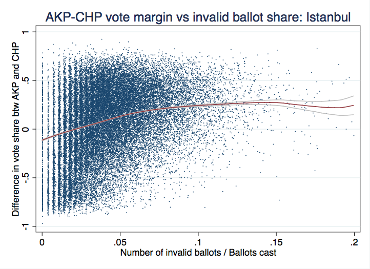
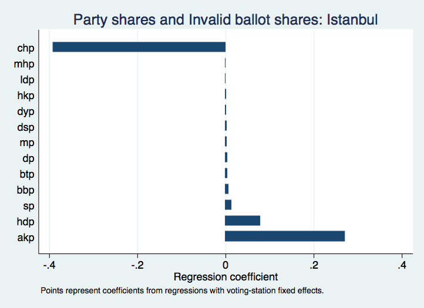

# Detecting Fraud in Turkish Election by Statistical Method
Lingyun Richard Xiao  
June 1, 2016  

## Advisors

-Dr. Sergey Samsonau from Princeton International School of Mathematics and Science

-Dr. Andi Shehu from City University of New York"

## Outline

- About Data Science 
- Introduction & Previous Work
- New Work
- Discussion & Conclusion
- Future Possible Directions
- References

## About Data Science 

- Statistical analysis of vast amount of heterogeneous data

- Visualization of the data distribution and implications

- Interdisciplinary applications

- Powerful tool in both academia and employment

## Introduction 

- 2014 Turkish presidential election
- AKP vote share vs. Turnout rates

<!-- -->

## Previous Work

- Twitter: Erik Meyersson
- Further analysis of the invalid ballot
 

## Previous Work

- Regression coefficient
 
 
## Previous Work

<!-- -->

## Previous Work

<!-- -->

## New Work

- Comparison of two groups of data divided by a certain turnout rate
  
  - Linear Regression

  - Slopes 
  
    - Ideal: Normal distribution of residuals
  
      - Two-sample z-test
      
      - p-value
  
    - Real: Non-normal distribution of residuals
      
      - Bootstrapping
  
      - Confidence Interval
  
      - Non-parametric t-test
  
## New Work: Normally distributed residuals

- Turnout rate division point: 0.96
- Compare the slopes by two-sample z-test

<!-- -->

## New Work: Non-normally distributed residuals

- Bootstrapping method
- Confidence Intervals

 

## New Work: Non-parametric t-test

- Loop through a range of turnout rate division values
- Non-parametric t-test
- Analyze the p-value in a range of turnout rate division value

 

## New Work

 

## Discussion & Conclusion

- Refined the single linear regression

- Separate the dataset by a turnout rate value and compare two samples of slopes

- Null Hypothesis: Samples of slopes on both sides of the turnout rate value are from the same underlying distribution

- Alternative Hypothesis: Samples of slopes on both sides of the turnout rate value are from the different underlying distribution 

## Discussion & Conclusion

- For normally distributed residuals:
    + two-sample z-test
    + z-score: 2.779, p-value < 0.01
    + Reject the null hypothesis
  
- For non-normally distributed residuals:
    + bootstrapping
    + non-parametric t-test
    + p-value < 0.01
    + Reject the null hypothesis
  
- Conclusion: AKP committed a voting fraud with a high probability

## References

Is Something Rotten In Ankara's Mayoral Election? A Very Preliminary Statistical Analysis. (2014, April 1). Retrieved January 8, 2016, from http://erikmeyersson.com/2014/04/01/is-something-rotten-in-ankaras-mayoral-election-a-very-preliminary-statistical-analysis/

Donoho, D. (2015). 50 Years of Data Science.

James, G. (2013). An introduction to statistical learning with applications in R. Springer.

Chang, W. (2012). R graphics cookbook. Sebastopol, CA: O'Reilly Media.
